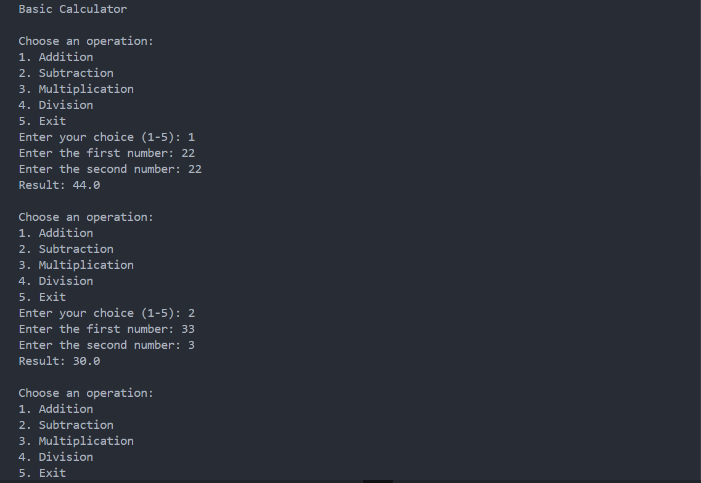
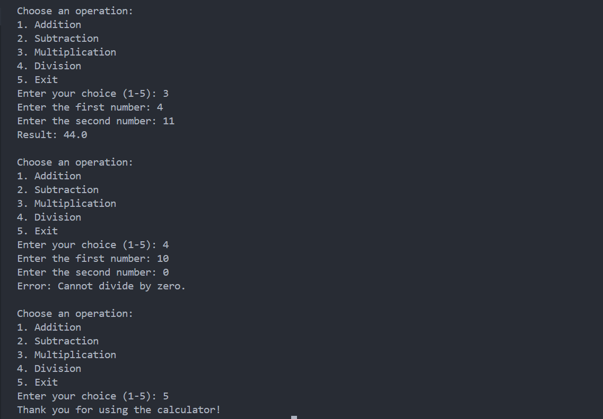

# Basic Calculator

A simple calculator program that performs basic arithmetic operations.

## Features

- Addition
- Subtraction
- Multiplication
- Division
- User input for numbers and operations
- Handles division by zero

## Technologies Used

- Python

## Screenshot




## How to Run

1. Clone the repository:

```bash
git clone https://github.com/YOUR-USERNAME/calculator.git
